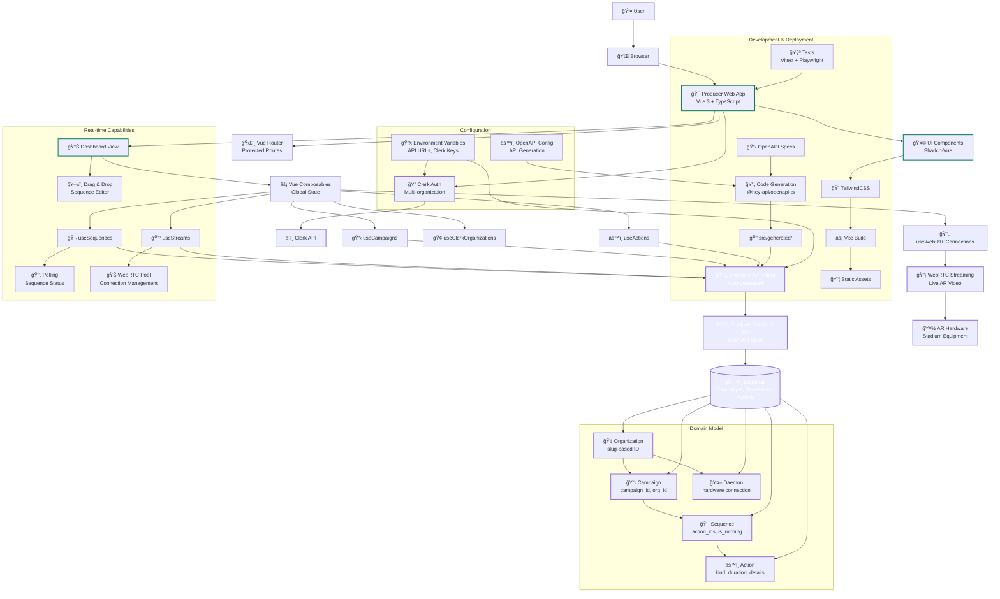

  

```mermaid
  graph TB
      %% User Layer
      User[👤 User] --> Browser[🌠Browser]

      %% Frontend Application
      Browser --> App[🯠Producer Web App<br/>Vue 3 + TypeScript]

      %% Authentication
      App --> Clerk[🔠Clerk Auth<br/>Multi-organization]
      Clerk --> ClerkAPI[â˜ï¸ Clerk API]

      %% Frontend Components
      App --> Router[ğŸ›£ï¸ Vue Router<br/>Protected Routes]
      App --> Dashboard[📊 Dashboard View]
      App --> Components[🧩 UI Components<br/>Shadcn-Vue]

      %% State Management
      Dashboard --> Composables[âš¡ Vue Composables<br/>Global State]
      Composables --> Campaign[📋 useCampaigns]
      Composables --> Sequence[🬠useSequences]
      Composables --> Action[âš™ï¸ useActions]
      Composables --> Stream[📹 useStreams]
      Composables --> WebRTC[🔄 useWebRTCConnections]
      Composables --> Organizations[🢠useClerkOrganizations]

      %% API Layer
      Campaign --> ProducerAPI[🔌 Producer API Client<br/>Auto-generated]
      Sequence --> ProducerAPI
      Action --> ProducerAPI
      Stream --> ProducerAPI

      %% Backend Services
      ProducerAPI --> ProducerBackend[âš™ï¸ Producer Backend API<br/>OpenAPI Spec]
      ProducerBackend --> Database[(ğŸ—ƒï¸ Database<br/>Campaigns, Sequences, Actions)]

      %% Real-time Streaming
      WebRTC --> StreamingService[📡 WebRTC Streaming<br/>Live AR Video]
      StreamingService --> ARHardware[🥽 AR Hardware<br/>Stadium Equipment]

      %% Domain Entities Flow
      subgraph "Domain Model"
          Org[🢠Organization<br/>slug-based ID]
          Camp[📋 Campaign<br/>campaign_id, org_id]
          Seq[🬠Sequence<br/>action_ids, is_running]
          Act[âš™ï¸ Action<br/>kind, duration, details]
          Daemon[🤖 Daemon<br/>hardware connection]

          Org --> Camp
          Camp --> Seq
          Seq --> Act
          Org --> Daemon
      end

      %% Data Flow
      Database --> Org
      Database --> Camp
      Database --> Seq
      Database --> Act
      Database --> Daemon

      %% Build & Deployment
      subgraph "Development & Deployment"
          OpenAPI[📋 OpenAPI Specs] --> CodeGen[🔄 Code Generation<br/>@hey-api/openapi-ts]
          CodeGen --> Generated[📠src/generated/]
          Generated --> ProducerAPI

          Vite[⚡ Vite Build] --> Dist[📦 Static Assets]
          TailwindCSS[🨠TailwindCSS] --> Vite

          Tests[🧪 Tests<br/>Vitest + Playwright] --> App
      end

      %% Styling
      Components --> TailwindCSS

      %% Real-time Features
      subgraph "Real-time Capabilities"
          Polling[🔄 Polling<br/>Sequence Status]
          WebRTCPool[🊠WebRTC Pool<br/>Connection Management]
          DragDrop[ğŸ–±ï¸ Drag & Drop<br/>Sequence Editor]

          Sequence --> Polling
          Stream --> WebRTCPool
          Dashboard --> DragDrop
      end

      %% Environment Configuration
      subgraph "Configuration"
          EnvVars[🔧 Environment Variables<br/>API URLs, Clerk Keys]
          OpenAPIConfig[âš™ï¸ OpenAPI Config<br/>API Generation]

          EnvVars --> ProducerAPI
          EnvVars --> Clerk
          OpenAPIConfig --> CodeGen
      end

      %% Styling
      classDef primary fill:\#3b82f6,stroke:\#1e40af,stroke-width:2px,color:\#fff
      classDef secondary fill:\#10b981,stroke:#047857,stroke-width:2px,color:\#fff
      classDef tertiary fill:\#f59e0b,stroke:\#d97706,stroke-width:2px,color:#fff
      classDef data fill:\#8b5cf6,stroke:\#7c3aed,stroke-width:2px,color:\#fff
      classDef external fill:\#ef4444,stroke:\#dc2626,stroke-width:2px,color:\#fff

      %% Apply styles
      class User,Browser primary
      class App,Dashboard,Components secondary
      class ProducerAPI,ProducerBackend,Database tertiary
      class Clerk,ClerkAPI,StreamingService,ARHardware external
      class Org,Camp,Seq,Act,Daemon data
```