## Overview
A lightweight, embeddable feedback widget that allows users to submit feedback directly from any website, automatically creating structured GitHub issues — with AI-assisted code generation via `@claude` or `@codex` mentions.

The system ensures **secure repository access**, **high-quality feedback filtering**, and **automated AI responses**, while giving customers full control over how the feedback widget looks and behaves on their site.

---

## 🔘 Core Functionality

### Feedback Button (Component)
- A rendered button/UI element embedded on any website.  
- Opens a modal dialog for users to enter feedback (description, reproduction steps, optional screenshot).  
- On submission, the feedback is sent securely to Pullreque.st’s backend for processing.

### Issue Creation Pipeline
1. The component sends the feedback payload to Pullreque.st’s backend.  
2. The backend enriches the submission with contextual metadata:  
   - User/device info (browser, OS, viewport)  
   - URL and page context  
   - Console/network logs (if permitted)  
3. Pullreque.st validates and filters the feedback (e.g., removes low-quality or spam input).  
4. A structured GitHub issue is created in the customer’s configured repository with `@claude` or `@codex` appended to trigger AI code generation for a proposed fix.

---

## 👥 Roles & Vocabulary

- **User** — The person interacting with the feedback component on a website.  
- **Customer** — A paying client who configures and installs the feedback widget on their site.  
- **Component** — The embeddable UI button and feedback modal placed on the customer’s website.

---

## 🧱 Integration & Architecture

### Embeddable Delivery
- Distributed as an iframe-based, copy-pastable snippet.  
- Requires minimal setup — customers drop it into their site with one line of code.

```html
<iframe
  src="https://pullreque.st/widget.js"
  data-repo="customer/repo"
  data-theme="light"
  data-style='{"color":"#222","borderRadius":"8px"}'>
</iframe>
```


## ⚙️ Admin Dashboard

A centralized interface for **setup, customization, and management**, allowing customers to:

### 1. Connect GitHub

- Authenticate via GitHub OAuth.    
- Select which repository issues should be created in.
- Manage and revoke OAuth permissions securely.

### 2. Customize Widget Appearance

- Configure the widget’s visual identity to match their site’s design system:
- Button color, text color, hover states
- Border radius, border width, shadow, padding
- Font family and size
- Default text and icon
- Real-time preview of changes before publishing.
- Optional **“custom CSS”** input for advanced styling.

### 3. Manage Feedback Rules

- Define moderation thresholds (e.g., minimum length, toxicity filters).
- Enable/disable console or network log collection.
- Set default issue labels (e.g., “user feedback”, “bug report”).

### 4. Analytics & Insights

- View summary metrics: feedback volume, AI-generated issue success rate, and user sentiment.
- Optionally sync analytics to external dashboards via webhooks.    

---

## 🔐 Security Considerations

- Users **do not** interact directly with GitHub.  
All feedback routes through Pullreque.st’s backend, ensuring:
- No exposure of repository credentials.        
- Repository access restricted to “create issue” permission only.        
- Moderation and validation prior to issue creation.

---

## 🧠 AI & Feedback Filtering

- A lightweight NLP model screens feedback for spam, profanity, or low-value input. 
- AI trigger mentions (`@claude`, `@codex`) are appended only to valid, actionable feedback.
- The resulting GitHub issue automatically prompts an AI model to draft an initial code implementation or fix suggestion.

```mermaid
sequenceDiagram
  autonumber
  participant User as User (Visitor)
  participant Widget as Feedback Widget (iframe)
  participant API as Backend API Gateway
  participant Mod as Moderation/Quality Filter
  participant Ctx as Context Enricher (URL, device, logs)
  participant Build as Ticket Builder
  participant GH as GitHub Issues API (Customer Repo)
  participant AI as AI Assistant (@claude/@codex)
  participant Dash as Admin Dashboard
  participant Anal as Analytics

  User->>Widget: Click "Give Feedback" button
  Widget->>User: Show modal (text, steps, screenshot)
  User->>Widget: Submit feedback
  Widget->>API: POST /feedback {text, meta, screenshot?}
  API->>Mod: Evaluate quality (length, toxicity, regex rules)
  alt Feedback invalid
    Mod-->>API: Rejected(reason)
    API-->>Widget: 422 Unprocessable Entity (friendly message)
    API->>Anal: log.reject
  else Feedback valid
    Mod-->>API: OK
    API->>Ctx: Collect URL, device/OS/browser, console/network logs*
    Note over Ctx: Logs only if customer enabled in dashboard
    Ctx-->>API: Enriched payload
    API->>Build: Compose structured ticket\n(labels, template, @claude/@codex)
    Build-->>API: Issue body + metadata
    API->>GH: Create Issue
    GH-->>API: Issue #{id} created
    API->>Anal: log.issue_created
    API-->>Widget: 200 Created (thank-you UI)
    GH->>AI: Trigger via mention (@claude/@codex)
    AI-->>GH: Post comment with proposed fix / patch plan
    GH->>Dash: Webhook → show issue + AI suggestion
    Anal-->>Dash: Metrics (volume, pass rate, time-to-suggestion)
  end

  Note over Dash: Admin can configure:\n• GitHub OAuth & repo\n• Appearance (colors, radius, border, font, text)\n• Rules/labels & logging\n• Preview & publish
```




